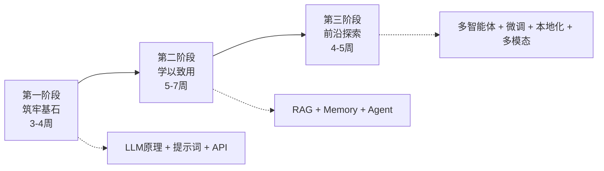
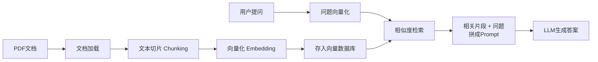
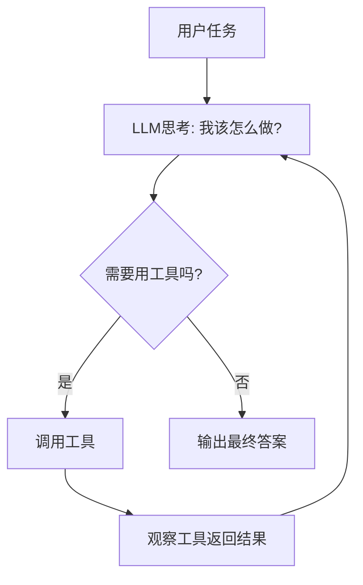

# 大语言模型应用开发与智能体进阶学习路线

## 学习地图总览



| 阶段 | 主题 | 预计周期 | 核心产出 |
|------|------|----------|----------|
| 第一阶段 | 大模型开发通识 | 3~4 周 | 会调 API、会写高质量 Prompt |
| 第二阶段 | RAG 与 Agent 实战 | 5~7 周 | 3 个可展示的微型项目 |
| 第三阶段 | 前沿探索 | 4~5 周 | 多智能体 Demo + 本地部署 |

---

# 第一阶段：筑牢基石 —— 大模型开发通识

> **预计周期：3~4 周**
> **目标**：搞懂"大模型到底是什么"，并能用 Python 稳定地调用它。

## 1.1 核心概念（用大白话理解 LLM）

不需要一上来就啃论文，先建立正确的"直觉"。

### Token：模型眼里的世界
大模型不认识"字"，只认识 **Token**（词元）。一段中文/英文会被切成一个个小块。

- 英文中 `1 Token ≈ 0.75 个单词`
- 中文中 `1 个汉字 ≈ 1~2 个 Token`
- **为什么重要**：API 按 Token 计费，上下文长度也按 Token 计算。

> 动手体验：打开 [OpenAI Tokenizer](https://platform.openai.com/tokenizer)，输入一句话看看它是怎么被切分的。

### Transformer 与"概率分布"：模型如何"说话"
你可以把 LLM 想象成一个 **超级强大的"文字接龙"游戏机**：

1. 给它一段话（Prompt）；
2. 它会计算"下一个 Token 最可能是什么"，输出一个 **概率分布**；
3. 从概率里挑一个词，接上，再重复第 2 步……

Transformer 的核心是 **注意力机制（Attention）**：模型在预测下一个词时，会"回头看"前文中哪些词最相关。这就是它能理解长文本上下文的秘密。

> **关键认知**：LLM 本质是"概率预测"，它不"知道"真理，只是"预测最像人话的下一个词"。这也是它会"一本正经地胡说八道"（幻觉）的根本原因。

### 推荐资源
- 视频（强烈推荐）：3Blue1Brown《[But what is a GPT?](https://www.youtube.com/watch?v=wjZofJX0v4M)》—— 可视化讲解 Transformer
- 图解：Jay Alammar《[The Illustrated Transformer](https://jalammar.github.io/illustrated-transformer/)》
- 中文入门：李宏毅《机器学习》生成式 AI 部分（B 站有搬运）

## 1.2 提示词工程（Prompt Engineering）

> 提示词工程 ≠ 玄学咒语，而是一套**可复用的设计模式**。

### 基础原则
1. **明确角色**：`你是一位资深的 Python 老师……`
2. **给出清晰指令**：要做什么、输出什么格式。
3. **提供上下文**：把必要的背景信息喂给它。
4. **指定输出格式**：如"用 JSON 输出""用表格总结"。

### 核心设计模式（Prompt Design Pattern）

**① Few-shot（少样本示例）**
给模型几个例子，让它照猫画虎。

```text
请判断下面评论的情感（正面/负面）：

评论：这家餐厅太棒了！ -> 正面
评论：等了一小时菜还没上。 -> 负面
评论：环境不错，就是有点贵。 ->
```

**② Chain-of-Thought / CoT（思维链）**
让模型"一步一步思考"，显著提升推理准确率。

```text
问题：小明有 5 个苹果，吃了 2 个，又买了 3 袋每袋 4 个，现在有几个？
请一步一步推理后再给出答案。
```

**③ 角色扮演 + 约束**
组合使用：`你是严谨的数学老师，只回答与数学相关的问题，遇到其他问题请礼貌拒绝。`

### 推荐资源
- [OpenAI 官方 Prompt Engineering 指南](https://platform.openai.com/docs/guides/prompt-engineering)
- [吴恩达 + OpenAI《ChatGPT Prompt Engineering for Developers》](https://www.deeplearning.ai/short-courses/chatgpt-prompt-engineering-for-developers/)（免费，1.5 小时）
- [Prompt Engineering Guide（中文版）](https://www.promptingguide.ai/zh)

## 1.3 API 交互基础

### 环境搭建
```bash
# 创建虚拟环境（强烈建议！避免污染全局）
python -m venv venv
# Windows 激活
venv\Scripts\activate
# 安装依赖
pip install openai python-dotenv
```

### API Key 的安全管理（重要！）
**永远不要把 API Key 硬编码在代码里，更不要上传到 GitHub！**

在项目根目录新建 `.env` 文件：
```text
OPENAI_API_KEY=sk-你的密钥
OPENAI_BASE_URL=https://api.openai.com/v1
```

同时在 `.gitignore` 里加入 `.env`，防止误提交。

### 第一个 API 调用
```python
import os
from dotenv import load_dotenv
from openai import OpenAI

load_dotenv()  # 加载 .env 文件

client = OpenAI(
    api_key=os.getenv("OPENAI_API_KEY"),
    base_url=os.getenv("OPENAI_BASE_URL"),
)

response = client.chat.completions.create(
    model="gpt-4o-mini",  # 便宜又够用的入门模型
    messages=[
        {"role": "system", "content": "你是一个乐于助人的助手。"},
        {"role": "user", "content": "用一句话解释什么是 Token。"},
    ],
    temperature=0.7,
    max_tokens=200,
)

print(response.choices[0].message.content)
```

### 关键参数详解
| 参数 | 作用 | 取值建议 |
|------|------|----------|
| `temperature` | 控制随机性/创造力，越高越"发散" | 严谨任务 0~0.3；创意写作 0.7~1.0 |
| `top_p` | 核采样，另一种控制随机性的方式 | 一般与 temperature 二选一调，默认 1.0 |
| `max_tokens` | 限制**输出**的最大长度 | 按需设置，防止超长/超费 |
| `messages` | 对话历史（system/user/assistant） | 多轮对话靠它维持上下文 |

> **小贴士**：`temperature` 和 `top_p` 不要同时大幅调整，选一个调即可。

## 1.4 数据基础（为 RAG 做准备）

后续 RAG 项目要处理大量文档，先练好数据处理基本功。

### JSON 处理
```python
import json

# 读取
with open("data.json", "r", encoding="utf-8") as f:
    data = json.load(f)

# 写入
with open("output.json", "w", encoding="utf-8") as f:
    json.dump(data, f, ensure_ascii=False, indent=2)
```

### Markdown / 文本清洗基础
- 去除多余空白、特殊符号；
- 统一编码为 UTF-8；
- 按段落 / 标题切分文本（为后续切片打基础）。

```python
import re

def clean_text(text: str) -> str:
    text = re.sub(r"\s+", " ", text)      # 合并多余空白
    text = text.strip()                    # 去首尾空格
    return text
```

## ⚠️ 第一阶段避坑指南

| 坑 | 解决建议 |
|----|----------|
| API Key 泄露（传到了 GitHub） | 用 `.env` + `.gitignore`；泄露后立刻去官网重置密钥 |
| 把 LLM 当"搜索引擎"，全盘相信输出 | 记住它会"幻觉"，重要信息务必核实 |
| 一开始就用最贵的模型烧钱 | 学习阶段用 `gpt-4o-mini` 等便宜模型足够 |
| 不设 `max_tokens` 导致账单爆炸 | 养成设置上限的习惯 |
| Prompt 写得含糊，抱怨模型笨 | 先检查自己的指令是否清晰、是否给了示例 |
| 直接在 Jupyter 里裸奔不用虚拟环境 | 每个项目独立 venv，依赖清爽可复现 |

---

# 第二阶段：学以致用 —— 构建第一个 RAG 与 Agent

> **预计周期：5~7 周**
> **理念**：三个递进式微型项目，从"会检索"到"有记忆"再到"能干活"。

## 项目一：简易的"PDF 知识库问答机器人"（RAG 入门）

> **预计：2~2.5 周**
> **场景**：把课程 PDF 讲义丢进去，让机器人根据讲义内容回答你的问题。

### 为什么需要 RAG？
LLM 不知道你的私人文档、也不知道最新信息。**RAG（检索增强生成）** 的思路是：
> 先从你的资料库里"检索"出相关内容，再把它塞给 LLM 让它"照着回答"。

### RAG 核心流程


### 知识点拆解
1. **文档加载器（Loader）**：读取 PDF/TXT/Markdown。
2. **文本切片（Chunking）**：长文档切成小块（如每块 500 字），是 RAG 效果的关键。
3. **Embeddings（向量化）**：把文字转成一串数字（向量），语义相近的文字向量也相近。
4. **向量数据库**：存储向量并支持快速相似度检索（ChromaDB / FAISS）。
5. **相似度检索**：找出与问题最相关的 N 个片段。

### 技术栈
`LangChain`（或 `LlamaIndex`）+ `ChromaDB` + `Streamlit`

```bash
pip install langchain langchain-openai langchain-community chromadb pypdf streamlit
```

### 核心代码骨架
```python
from langchain_community.document_loaders import PyPDFLoader
from langchain.text_splitter import RecursiveCharacterTextSplitter
from langchain_openai import OpenAIEmbeddings, ChatOpenAI
from langchain_community.vectorstores import Chroma
from langchain.chains import RetrievalQA

# 1. 加载 PDF
loader = PyPDFLoader("讲义.pdf")
docs = loader.load()

# 2. 切片
splitter = RecursiveCharacterTextSplitter(chunk_size=500, chunk_overlap=50)
chunks = splitter.split_documents(docs)

# 3. 向量化 + 存入向量库
vectorstore = Chroma.from_documents(chunks, OpenAIEmbeddings())

# 4. 构建问答链
qa = RetrievalQA.from_chain_type(
    llm=ChatOpenAI(model="gpt-4o-mini"),
    retriever=vectorstore.as_retriever(search_kwargs={"k": 3}),
)

# 5. 提问
print(qa.invoke("这份讲义的核心观点是什么？"))
```

### 用 Streamlit 加个简单 UI
```python
import streamlit as st

st.title("📚 我的 PDF 问答机器人")
question = st.text_input("请输入你的问题：")
if question:
    answer = qa.invoke(question)
    st.write(answer["result"])
```
运行：`streamlit run app.py`

### 难点攻克：检索不准怎么办？
1. **调整切片策略**：chunk 太大→噪声多；太小→信息碎。多试几个尺寸。
2. **增加检索数量 k**：召回更多候选片段。
3. **重排序（Rerank）**：先粗召回 20 条，再用一个专门的 Rerank 模型（如 Cohere Rerank、bge-reranker）精排出最相关的 3 条，显著提升准确率。
4. **优化 Embedding 模型**：中文场景可试 `bge-large-zh`、`m3e`。

### 推荐资源
- [LangChain 官方文档 - RAG](https://python.langchain.com/docs/tutorials/rag/)
- [LlamaIndex 官方入门](https://docs.llamaindex.ai/en/stable/getting_started/starter_example/)
- [Streamlit 官方文档](https://docs.streamlit.io/)

---

## 项目二：具备记忆的"个性化聊天伴侣"（Memory 机制）

> **预计：1.5~2 周**
> **场景**：做一个能记住你名字、聊天偏好，甚至越聊越懂你的 AI 伴侣。

### 为什么需要 Memory？
API 本身是"无状态"的——每次调用它都"失忆"。要实现连贯的多轮对话，必须自己管理对话历史。

### 知识点拆解
1. **对话历史存储**：把 user / assistant 的每轮对话记下来。
2. **滑动窗口记忆（Buffer Window）**：只保留最近 N 轮，防止上下文超长。
3. **摘要记忆（Summary Memory）**：把旧对话压缩成摘要，既省 Token 又保留要点。
4. **持久化存储**：用 Redis / SQLite / 数据库存储，让"记忆"跨会话保留。

### 三种记忆策略对比
| 策略 | 优点 | 缺点 | 适用场景 |
|------|------|------|----------|
| 全量记忆 | 信息最全 | Token 爆炸、贵 | 短对话 |
| 滑动窗口 | 简单、可控 | 会"忘记"早期信息 | 一般聊天 |
| 摘要记忆 | 省 Token、记要点 | 摘要可能丢细节 | 长对话 |

### 核心代码示例（滑动窗口 + 持久化思路）
```python
from langchain_openai import ChatOpenAI
from langchain_core.chat_history import InMemoryChatMessageHistory
from langchain_core.runnables.history import RunnableWithMessageHistory
from langchain_core.prompts import ChatPromptTemplate, MessagesPlaceholder

llm = ChatOpenAI(model="gpt-4o-mini")
prompt = ChatPromptTemplate.from_messages([
    ("system", "你是一个温暖贴心的聊天伴侣，会记住用户说过的话。"),
    MessagesPlaceholder(variable_name="history"),
    ("human", "{input}"),
])
chain = prompt | llm

store = {}
def get_history(session_id: str):
    if session_id not in store:
        store[session_id] = InMemoryChatMessageHistory()
    return store[session_id]

chat = RunnableWithMessageHistory(
    chain, get_history,
    input_messages_key="input",
    history_messages_key="history",
)

config = {"configurable": {"session_id": "user_123"}}
print(chat.invoke({"input": "我叫小明，喜欢打篮球"}, config=config))
print(chat.invoke({"input": "还记得我喜欢什么运动吗？"}, config=config))
```

> **进阶**：把 `InMemoryChatMessageHistory` 换成 `RedisChatMessageHistory`，记忆就能持久化，重启程序也不会忘。

### 技术栈
`LangChain Memory 模块` + `Redis`（可选，用于持久化）

```bash
pip install langchain redis
```

### 推荐资源
- [LangChain Memory / Message History 文档](https://python.langchain.com/docs/how_to/message_history/)
- [Redis 快速上手](https://redis.io/docs/latest/develop/get-started/)

---

## 项目三：能干活的"全能小助手"（Agent 基础）

> **预计：2~2.5 周**
> **场景**：一个能主动"查天气、算数据、搜网页"的助手，你说需求，它自己决定用什么工具。

### 什么是 Agent（智能体）？
如果说前面的 LLM 只会"说"，那 Agent 就是会"做"——它能：
> **思考（Reason）→ 决定用哪个工具 → 行动（Act）→ 观察结果 → 继续思考……** 直到完成任务。

### 核心概念

**① Agent 核心循环**


**② ReAct 模式（Reasoning + Acting）**
让模型输出"思考过程 + 行动"，边想边做：
```text
Thought: 用户想知道北京天气，我需要调用天气工具
Action: get_weather(city="北京")
Observation: 北京今天晴，25℃
Thought: 我已经拿到信息了
Final Answer: 北京今天天气晴，气温 25℃。
```

**③ 工具（Tool）的定义与绑定**
把一个 Python 函数"注册"成工具，Agent 就能调用它。

### 核心代码示例（自定义工具 + Agent）
```python
from langchain_openai import ChatOpenAI
from langchain.agents import create_react_agent, AgentExecutor
from langchain_core.tools import tool
from langchain import hub

# 定义一个工具
@tool
def get_weather(city: str) -> str:
    """查询指定城市的实时天气。输入城市名，返回天气描述。"""
    # 实际项目中这里调用天气 API，这里用假数据演示
    return f"{city}今天晴，气温 25℃，适合出门。"

@tool
def calculator(expression: str) -> str:
    """计算数学表达式，例如 '2 * (3 + 4)'。"""
    return str(eval(expression))

tools = [get_weather, calculator]
llm = ChatOpenAI(model="gpt-4o-mini", temperature=0)

prompt = hub.pull("hwchase17/react")  # 拉取标准 ReAct 提示词模板
agent = create_react_agent(llm, tools, prompt)
executor = AgentExecutor(agent=agent, tools=tools, verbose=True)

executor.invoke({"input": "北京天气怎么样？顺便帮我算一下 128 * 15"})
```

### 实战拓展
- **接入实时搜索**：用 [Tavily Search](https://tavily.com/) 或 SerpAPI 让 Agent 能上网查资料。
- **Python REPL 工具**：让 Agent 写并执行 Python 代码，完成数据分析、画图等复杂计算。

```bash
pip install langchain tavily-python langchainhub
```

### 技术栈
`LangChain Agents` + `Tavily/SerpAPI`（搜索）+ `Python REPL Tool`

### 推荐资源
- [LangChain Agents 官方教程](https://python.langchain.com/docs/tutorials/agents/)
- [ReAct 论文（了解思想即可）](https://arxiv.org/abs/2210.03629)

## ⚠️ 第二阶段避坑指南

| 坑 | 解决建议 |
|----|----------|
| RAG 答非所问 | 90% 是切片/检索问题：调 chunk_size、加 Rerank、换 Embedding 模型 |
| 中文检索效果差 | 别用默认英文 Embedding，换 `bge-zh` / `m3e` 等中文模型 |
| Memory 越用越贵/报错超长 | 用滑动窗口或摘要记忆，别无脑存全量 |
| Agent 陷入死循环 | 设置 `max_iterations`，并给工具写清晰的 docstring |
| 工具描述含糊导致 Agent 乱调用 | Tool 的 docstring 要写清楚"做什么、输入什么、返回什么" |
| `eval()` 计算器有安全风险 | 学习可用，生产环境改用安全的表达式解析库 |
| LangChain 版本更新快，代码跑不通 | 认准官方文档对应版本，注意 import 路径变化 |

---

# 第三阶段：前沿探索 —— 通往 AGI 之路

> **预计周期：4~5 周**
> **理念**：打开视野，体验最前沿的玩法。不求精通，但求"见过、玩过、有感觉"。

## 3.1 多智能体系统（Multi-Agent）

> 一个 Agent 不够聪明？那就让**一群 Agent 分工协作**，模拟人类团队。

### 核心思想
给每个 AI 分配一个"角色"（如产品经理、程序员、测试员），让它们像真实团队一样互相讨论、交付成果。

### 主流框架
| 框架 | 特点 | 适合 |
|------|------|------|
| [AutoGen](https://microsoft.github.io/autogen/)（微软） | 灵活的多 Agent 对话框架 | 通用多智能体协作 |
| [MetaGPT](https://github.com/geekan/MetaGPT) | 模拟软件公司，一句话生成完整项目 | 软件开发流程 |
| [CrewAI](https://www.crewai.com/) | 上手简单，角色/任务清晰 | 快速搭协作流程 |

### 体验示例（AutoGen 双 Agent 协作）
```python
# pip install pyautogen
from autogen import AssistantAgent, UserProxyAgent

config_list = [{"model": "gpt-4o-mini", "api_key": "你的key"}]

engineer = AssistantAgent("程序员", llm_config={"config_list": config_list})
user = UserProxyAgent("用户", human_input_mode="NEVER", code_execution_config={"work_dir": "coding"})

user.initiate_chat(engineer, message="写一个 Python 函数计算斐波那契数列前10项并运行")
```

## 3.2 模型微调入门（Fine-tuning）

### RAG vs 微调：什么时候用哪个？
| | RAG | 微调（Fine-tuning） |
|---|-----|---------------------|
| 解决的问题 | 让模型"知道"新知识/私有数据 | 让模型"学会"新风格/新能力 |
| 类比 | 开卷考试（带资料） | 考前突击培训 |
| 成本 | 低，改资料即可 | 高，需要数据 + 算力 |
| 适用 | 知识频繁更新、问答 | 固定风格、特定任务格式 |

> **经验法则**：**先用 RAG 和 Prompt，实在搞不定再考虑微调。** 90% 的场景 RAG 就够了。

### PEFT 与 LoRA（重点理解思想）
- **全量微调**：调整模型全部参数，又贵又慢，学生党玩不起。
- **PEFT（参数高效微调）**：只调一小部分参数，省资源。
- **LoRA**：PEFT 中最流行的方法。**打个比方**：不重新装修整栋房子，只给墙上贴几张"便利贴"（低秩矩阵），就能改变模型行为，成本极低。

### 推荐资源
- [Hugging Face PEFT 库](https://huggingface.co/docs/peft)
- [LLaMA-Factory（可视化微调，新手友好）](https://github.com/hiyouga/LLaMA-Factory)

## 3.3 本地化与私有化部署

> 不想花钱调 API？不想数据泄露？把大模型跑在自己电脑上！

### Ollama：本地跑模型最简单的方式
```bash
# 1. 官网下载安装 Ollama：https://ollama.com/
# 2. 一行命令拉取并运行模型
ollama run qwen2.5        # 阿里通义千问，中文强
ollama run llama3.1       # Meta 的 Llama 3.1
```

### 用 Python 调用本地模型
Ollama 兼容 OpenAI 接口，代码几乎不用改：
```python
from openai import OpenAI

client = OpenAI(base_url="http://localhost:11434/v1", api_key="ollama")
resp = client.chat.completions.create(
    model="qwen2.5",
    messages=[{"role": "user", "content": "你好，你是谁？"}],
)
print(resp.choices[0].message.content)
```

> **硬件提示**：本地模型吃显存/内存。入门可选 7B 以下的小模型；显存不足可用量化版（如 `qwen2.5:7b-q4`）。

### 推荐资源
- [Ollama 官网 & 模型库](https://ollama.com/library)
- [LM Studio（图形界面，更适合小白）](https://lmstudio.ai/)

## 3.4 多模态应用（看图说话 & 生成图片）

### 看图说话（图 → 文）
用支持视觉的模型（如 `gpt-4o`、`qwen-vl`）理解图片内容：
```python
response = client.chat.completions.create(
    model="gpt-4o",
    messages=[{
        "role": "user",
        "content": [
            {"type": "text", "text": "这张图片里有什么？"},
            {"type": "image_url", "image_url": {"url": "https://example.com/cat.jpg"}},
        ],
    }],
)
print(response.choices[0].message.content)
```

### 生成图片（文 → 图）
```python
img = client.images.generate(
    model="dall-e-3",
    prompt="一只戴着宇航员头盔的柯基犬，在月球上，卡通风格",
    size="1024x1024",
)
print(img.data[0].url)
```

> **好玩的项目点子**：做一个"上传食材照片 → AI 告诉你能做什么菜"的应用，融合视觉理解 + 文本生成。

### 推荐资源
- [OpenAI Vision 文档](https://platform.openai.com/docs/guides/vision)
- 开源多模态模型：[Qwen-VL](https://github.com/QwenLM/Qwen2-VL)

## 3.5 AI 辅助开发（让 AI 帮你写代码）

> 学 AI 开发，当然要用 AI 来开发！善用工具能让效率翻倍。

### Cursor（AI 代码编辑器，强烈推荐）
- **Tab 补全**：智能预测你要写的整段代码。
- **Cmd/Ctrl + K**：选中代码，用自然语言让它修改。
- **Chat / Agent 模式**：直接对话，让它跨文件帮你实现功能、修 Bug。
- **@ 引用**：`@文件` `@文档` 精准提供上下文。

### GitHub Copilot
- IDE 内实时代码补全，VS Code / JetBrains 都支持。

### 使用心法（避免"AI 依赖症"）
1. **先理解再采纳**：AI 给的代码一定要看懂再用，别当黑盒。
2. **小步快跑**：让它一次做一件小事，好审查、好调试。
3. **给足上下文**：清晰描述需求 + 相关代码，输出质量更高。
4. **把它当"结对搭档"而非"甩手掌柜"**：你负责思考架构，它负责加速实现。

### 推荐资源
- [Cursor 官方文档](https://docs.cursor.com/)
- [GitHub Copilot 文档](https://docs.github.com/copilot)

## ⚠️ 第三阶段避坑指南

| 坑 | 解决建议 |
|----|----------|
| 多智能体互相"扯皮"、无限对话 | 设定明确的终止条件和最大轮次；角色职责要清晰 |
| 盲目上手微调，浪费时间金钱 | 先问自己"RAG 能不能解决"，能就别微调 |
| 本地模型跑不动 / 巨慢 | 选小模型 + 量化版；看清自己显存/内存够不够 |
| 以为本地小模型 = GPT-4 | 小模型能力有限，别用它做高难度任务后失望 |
| 多模态图片 URL 无法访问 | 确认图片是公网可访问，或用 base64 编码传入 |
| 过度依赖 AI 编程，自己不会写了 | AI 是加速器不是替代品，基础功还得自己练 |
| 生成图片/内容涉及版权与合规 | 注意使用条款，商用需谨慎，不生成侵权/违规内容 |

---

# 结语与进阶方向

恭喜你走完这条路线！到这里，你已经具备：
- ✅ 扎实的 LLM 应用开发基础认知
- ✅ 三个可以写进简历的实战项目（RAG / Memory / Agent）
- ✅ 对前沿方向（多智能体、微调、本地化、多模态）的实操体验

### 下一步可以往哪走？
1. **深耕工程化**：学习 LangGraph 构建复杂 Agent 工作流、模型评估（Evals）、可观测性（LangSmith）。
2. **参加比赛/开源**：Kaggle、GitHub 开源项目、黑客松（Hackathon）。
3. **做一个完整产品**：把学到的东西整合成一个真正能用的 App，部署上线。
4. **持续跟进前沿**：关注 arXiv、Hugging Face、各大厂技术博客。

### 长期学习资源
- [Hugging Face 学习社区](https://huggingface.co/learn)
- [DeepLearning.AI 短课程合集](https://www.deeplearning.ai/short-courses/)（大量免费优质课程）
- [LangChain / LlamaIndex 官方文档](https://python.langchain.com/)
- 关注 B 站、YouTube 上活跃的 AI 开发 UP 主 / 博主

> **最后的建议**：**动手，动手，还是动手！** 看十个教程不如自己写一个能跑的小项目。遇到 Bug 别怕，那正是你成长最快的时刻。祝你玩得开心，学有所成！🚀
